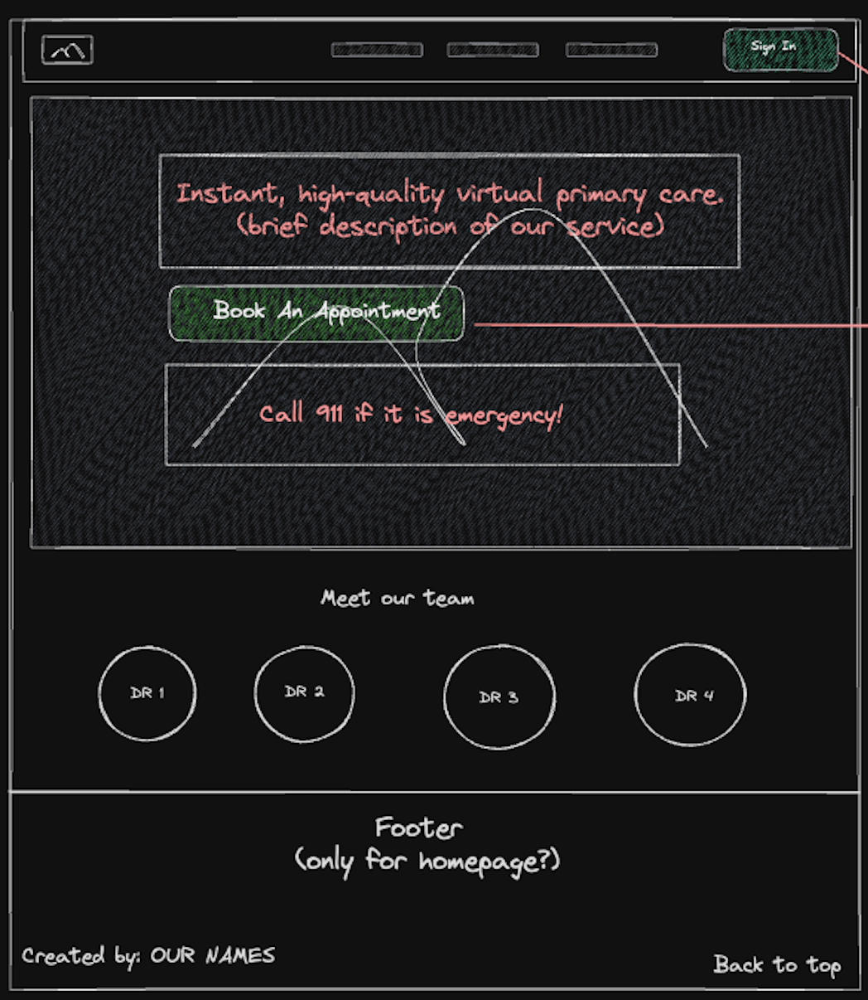
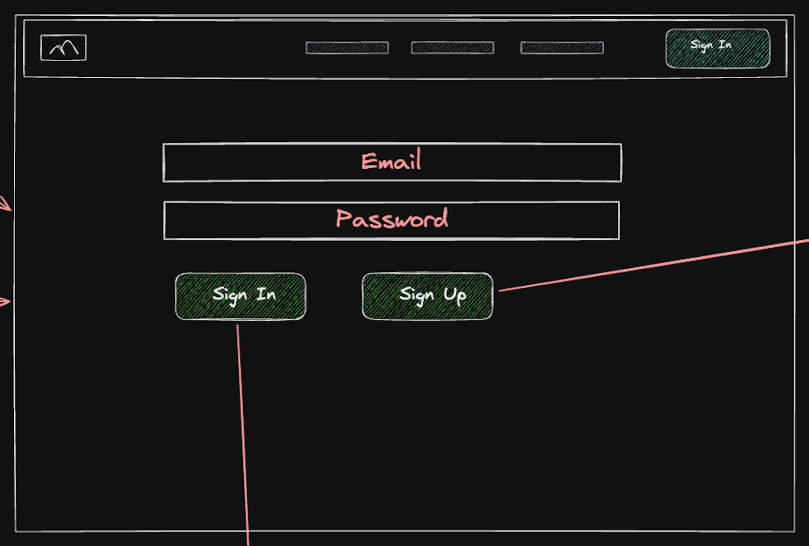
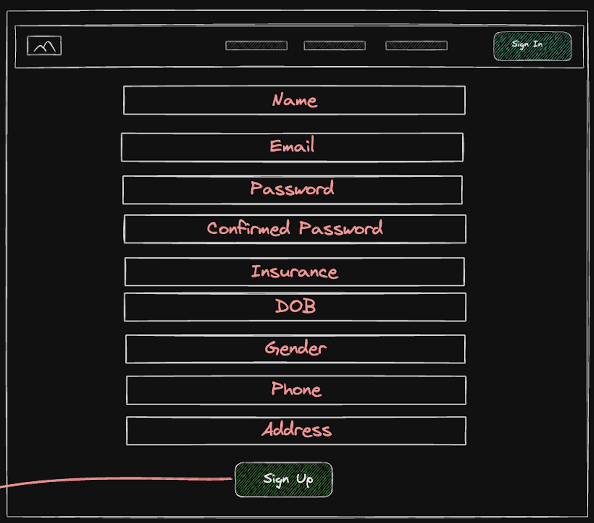
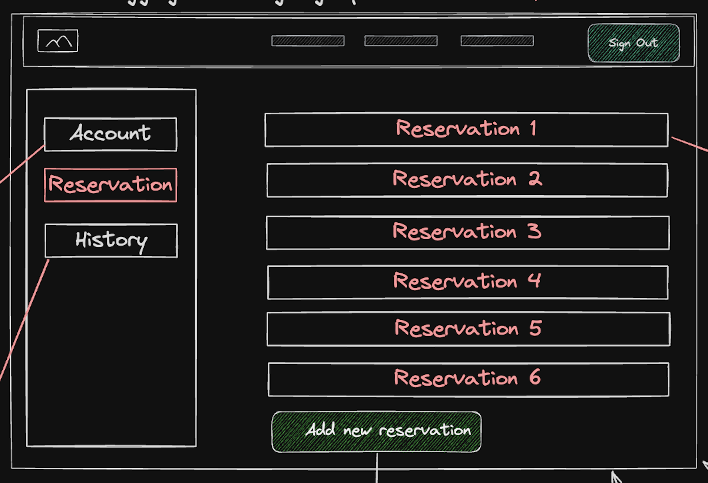
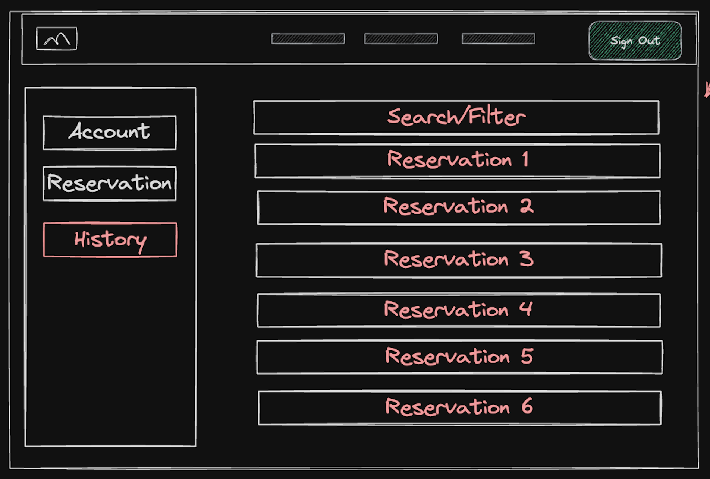
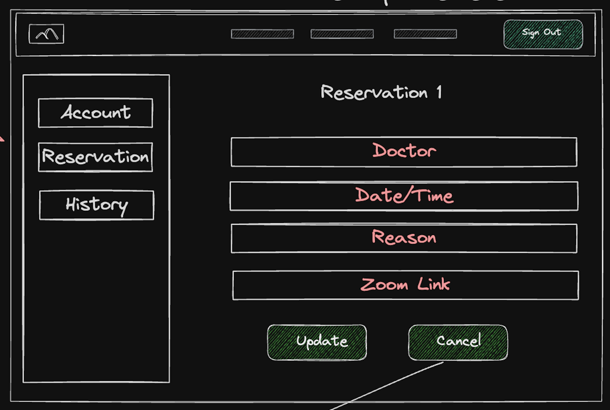
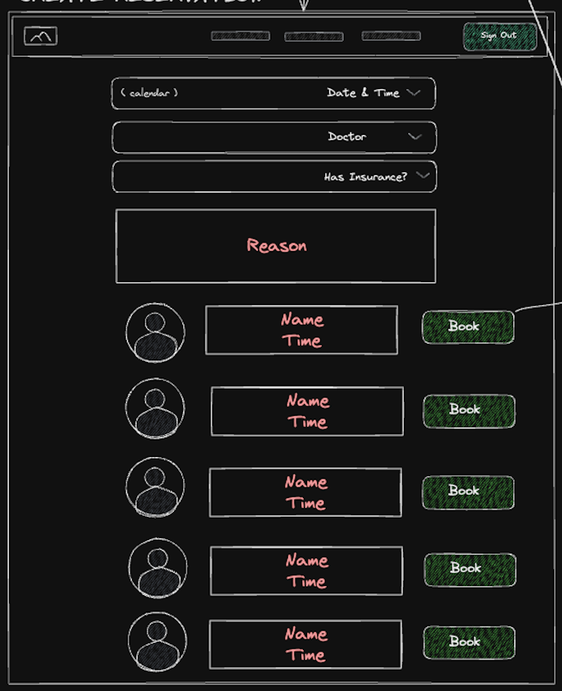

# Patient Grahpical Human Interface

## Home Page

This will be the first page patients arrive to on our website. Here they will see a navigation bar with the option
to log in and sign up. As well as as small introduction about our website, a section introducing our team of doctors
and a footer.

## Sign In Page

Patients can log in

## Create an Account

Patients can create an account here where they have to supply personal information like name, date of birth, gender, etc

## Reservation List Pages

Once a patient is logged in, they are redirected to their "current reservations" page where they can view all of their
upcoming reservations. Here they will have the option to create a new reservation, view their personal account page or
view their past reservations.

In original design, patients would be able to view their past reservations and be able to filter/search through
the list. But in our final design, we added the features that they can "cancel", "complete" and update a reservation instead.

## Reservation Detail Page

Here a patient can view more specific information regarding a specific reservation

## Create Reservation Page

When creating a reservation, patients will have to input a date, a time and a doctor of their choice. Along with whether they have insurance
and the reason for wanting to be seen.

## Account page

Patients can visit their account page where their personal information is listed and have the option to update their password, insurance, phone and address

